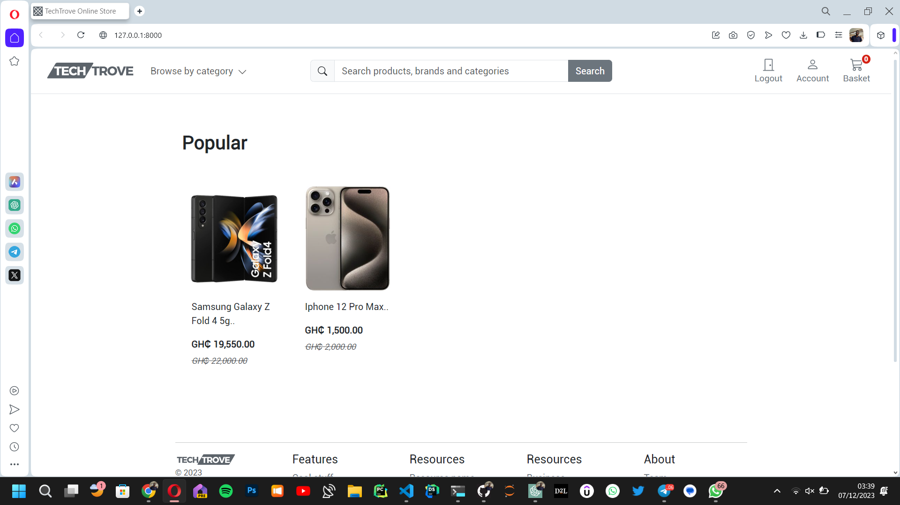
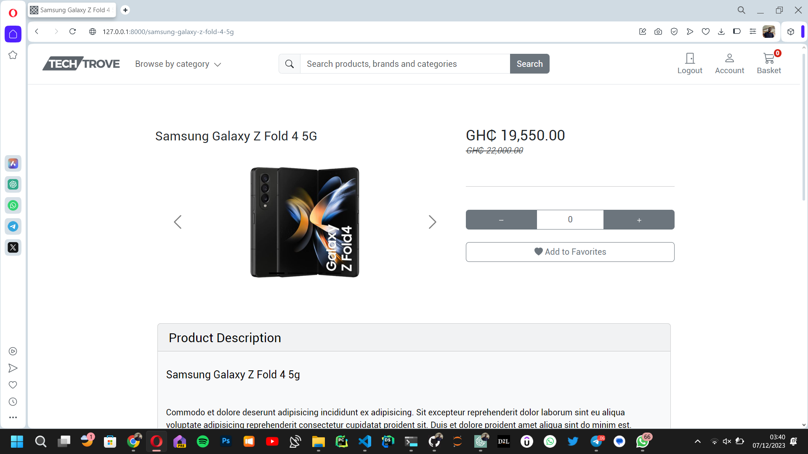

# TechTrove E-Commerce Store

## Description

TechTrove is an e-commerce store specializing in gadgets such as mobile phones and accessories. Our aim is to provide a seamless shopping experience for tech enthusiasts. While we currently focus on gadgets, we aim to expand into more categories in the future.

## Features

- Easy online payment system powered by PayStack.
- Ability to browse and purchase a wide range of gadgets and accessories.

## Technologies Used

- Python's Django framework
- HTML
- CSS
- Bootstrap
- JavaScript
- AJAX

## Installation

As a public website, no installation is required to access TechTrove. Simply visit [TechTrove.com](https://techtrove.com) to explore our store.

## Usage Guide

Instructions on how to use TechTrove will be provided in the future.

## Screenshots/Demo

## Contributing

Guidelines for contributing to TechTrove will be added later.

## Credits

- This project was inspired by the resources provided by Very Academy.

## Contact Information

For inquiries or support, you can reach out via:

- LinkedIn: [Henry Antwi](https://www.linkedin.com/in/henry-antwi-891906202/)
- Email: antwi.henry@outlook.com
